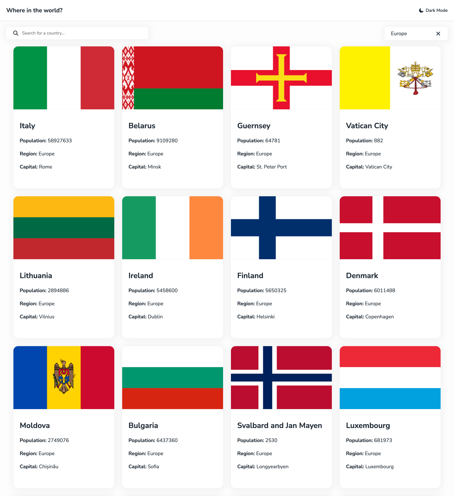
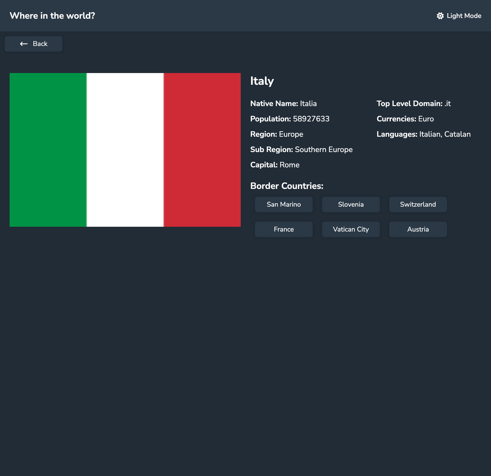
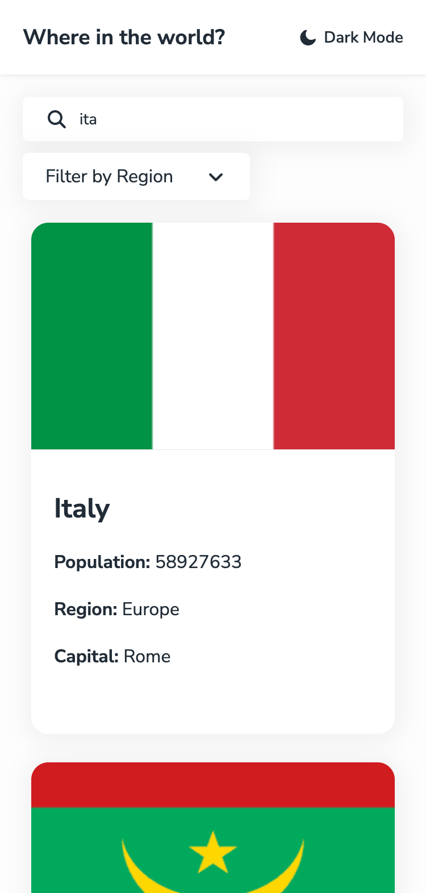

# 🌍 REST Countries Explorer

A responsive web application built with **React + TypeScript** that allows users to explore countries around the world using data from the REST Countries API.

This project is based on the *Frontend Mentor – REST Countries API challenge* and focuses on clean architecture, state management, and UI consistency.


[Live Demo](https://alepacc.github.io/rest-countries/)

##  Features

- View a list of all countries with basic information
- Search countries by name
- Filter countries by region (continent)
- View detailed information for a single country
- Navigate between border countries
- Toggle between **Light Mode / Dark Mode**
- Fully responsive layout


##  Technologies Used

- **React**
- **TypeScript**
- **React Router**
- **REST Countries API**
- **SCSS**
- **Font Awesome** icons
- **Vite**


##  Project Structure

The project follows a modular and scalable structure:
```bash
src/
├── components/     # Reusable UI components
├── pages/          # Route-based pages (Home, CountryDetail)
├── services/       # API calls
├── types/          # TypeScript interfaces
├── styles/         # Global and component styles
├── main.tsx        # Application entry point
└── App.tsx         # Main application component
```


##  What I Learned

During this project I practiced and improved:

- Fetching and handling external APIs
- Managing state with React hooks (`useState`, `useEffect`, `useMemo`)
- Filtering data efficiently on the client side
- Structuring a React project in a clean and maintainable way
- Using **TypeScript** to strongly type components and API responses
- Handling UI themes (light/dark mode)
- Building responsive layouts with SCSS
- Navigating between dynamic routes with React Router


##  How Filtering Works

- **Region filtering** is handled on the client side using `useMemo`
- **Search filtering** works by matching the country name against user input
- Filters can be combined without triggering additional API requests


##  Theme Management

The theme (light/dark) is managed locally using React state.
A CSS class is toggled on the `<body>` element to switch styles globally.


##  API

Data is fetched from the official REST Countries API: [restcountries.com/v3.1](https://restcountries.com/v3.1)

##  Getting Started

Clone the repository:

```bash
git clone https://github.com/alepacc/rest-countries.git
```
Move into the project folder:

```bash
cd rest-countries
```
Install dependencies:
```bash
npm install 
```
Run the project locally:
```bash
npm run dev
```


##  Screenshots
<!-- Aggiungi qui gli screenshot -->
### homepage

### country detail page

### mobile view



## Author
GitHub: [@alepacc](https://github.com/alepacc)